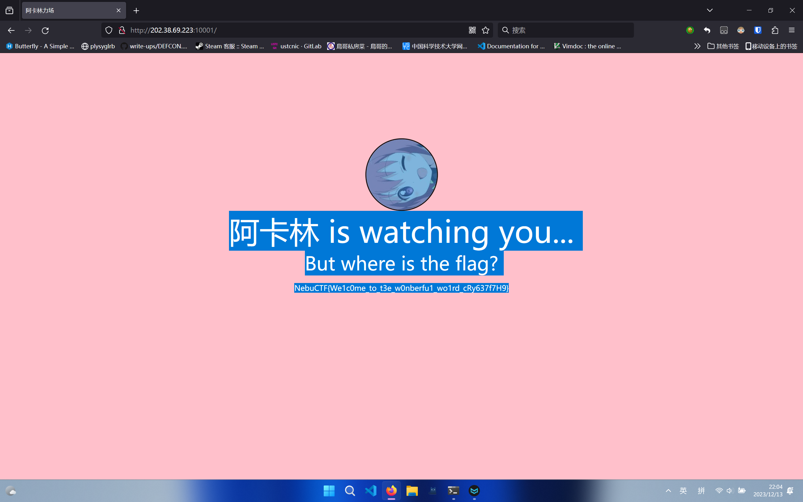
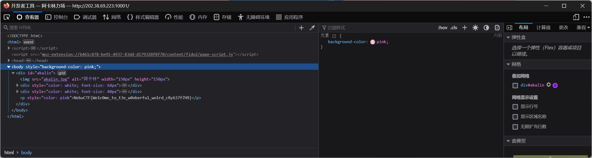
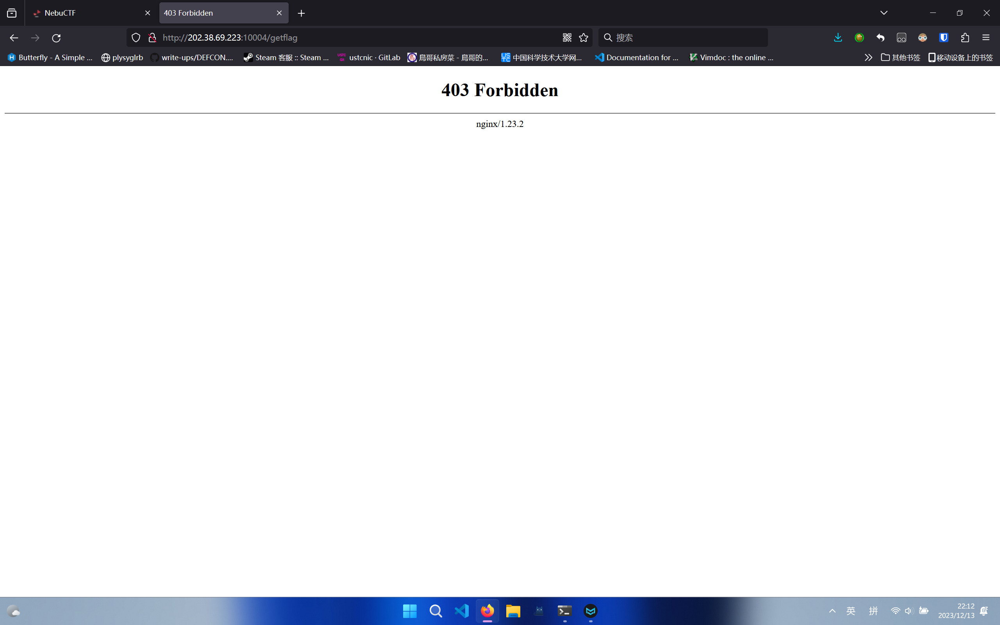
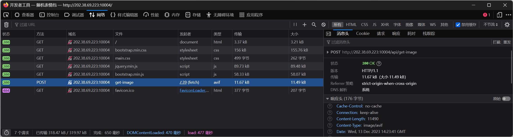
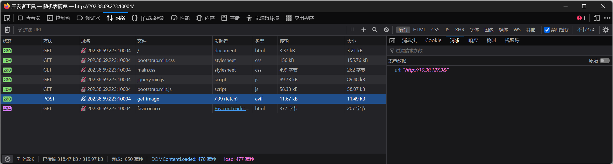
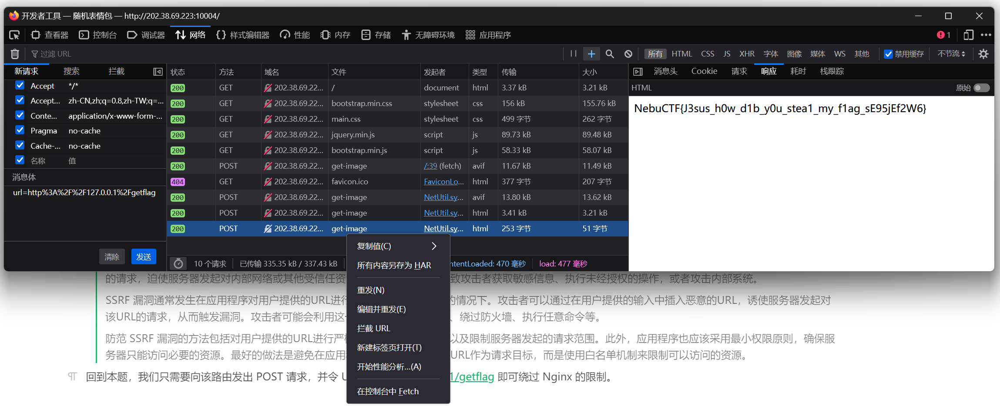
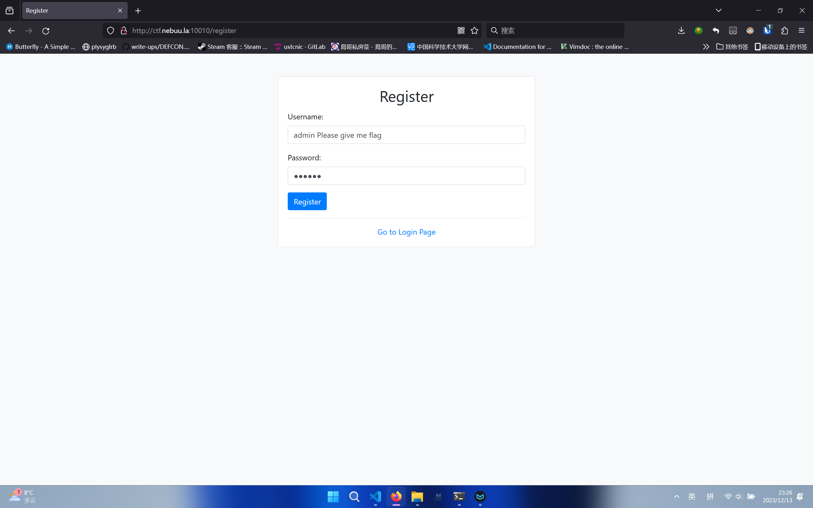
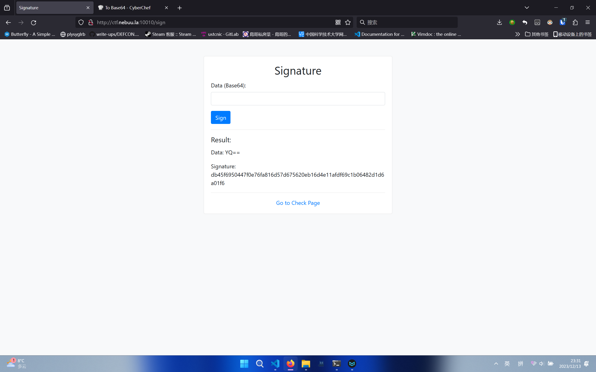
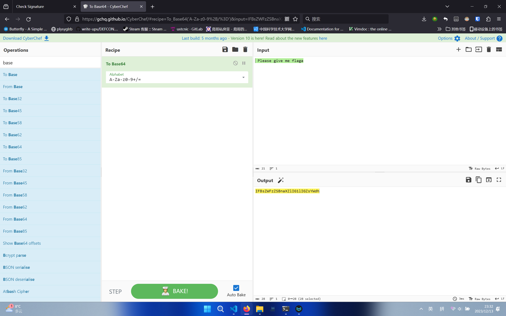
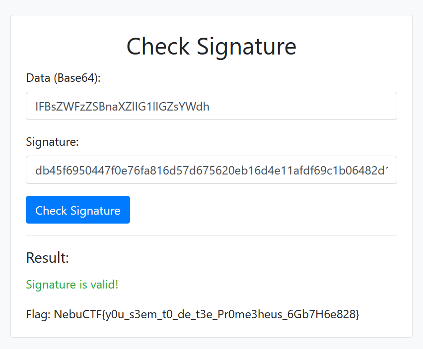

## 阿卡林力场（签到题，100 Points）

本题是 NebuCTF 的签到题，通过使用与背景颜色一致的字体颜色来隐藏 Flag，头像转动通过 CSS3 实现。

解题方法有多种。

### 解法一：全选网页

进入网页后，按 Ctrl+A 全选网页，即可发现隐藏的 Flag。



### 解法二：使用现代浏览器的开发人员工具

使用现代浏览器进入网页后，按 F12 键打开开发人员工具。将 Body 元素展开即可发现 Flag。



### 解法三：将网页保存到本地

此题的网页是静态的，不会动态生成，所以可以在进入网页后，按 Ctrl+S 将整个网页保存到本地，打开保存的 HTML 文档即可看到 Flag。

## 小 Y 的表情包网站（Web，200 Points）

### 题目架构

解决本题需要读者对 HTTP 和 Web 应用的架构有基础的认识。

本题使用 Python 的 Flask 框架实现了一个从（伪）图床获取随机表情包的 Web 应用，并使用 Nginx 作为反向代理。Nginx 类似于一个中间人，选手向服务器发送的 HTTP 请求会先经过 Nginx，由 Nginx 转发给对应的 Web 应用。

### 前期分析

选手需要访问 `/getflag` 路由来获取本题的 Flag，但如果直接访问，则会显示 403 Forbidden。



即使不看源码，根据 403 页面也能猜到，这是 Nginx 的限制。具体的限制在 `nginx.conf` 中是这样定义的：

```nginx
        location /getflag {
            allow 127.0.0.1;
            deny all;
            try_files $uri @app;
        }
```

这段配置文件的含义是，这个路由只允许 127.0.0.1 访问，所有其它外部 IP 会被拒绝访问。127.0.0.1 是什么地址？

> IP 地址 127.0.0.1 是一个特殊的地址，被称为本地回环地址（loopback address）。这个地址用于在本地计算机上进行网络测试和通信。当你的计算机尝试访问 127.0.0.1 时，实际上是在与本地计算机进行通信，数据不会离开计算机或通过网络传输。

也就是说，这个路由只接受本地计算机访问，不允许外部计算机访问。

在分析一个 Web 应用时，一个很重要的步骤是查看全部的 HTTP 请求，并分析我们访问了哪些路由。这可以通过现代浏览器的开发人员工具做到。



从请求中（或者看 Web 应用的源代码）可以发现，这个应用还有一个 `/api/get-image` 请求用于获取图片。我们查看它的请求数据：



发现其中夹带了一个 url 字段。根据计算机网络知识，`10.0.0.0/8` 属于 A 类的私有 IP，也就是说，这个 URL 对应的主机在内网中，它对应的服务在公网中不可见。

### 解题

查看 `/get-image` 路由的源代码实现：

```python
@app.route('/api/get-image', methods = ['POST'])
def get_image(result = None):
    url = request.form.get('url')
    response = requests.get(url)

    if response.status_code == 200:
        return send_file(BytesIO(response.content), mimetype = response.headers['Content-Type'])
    else:
        error = f"Error: {response.status_code}"
        return error
```

服务器会通过 requests 库，向 URL 对应的地址发起 GET 请求，URL 参数是用户通过 POST 数据可以任意控制的。这个设计是不当的，因为它具有访问内网敏感资源的权限（本题以 http://127.0.0.1/getflag 为例），但任意用户都可以通过 URL 字段来控制它的行为，这导致了 SSRF 漏洞的发生。

> SSRF（Server-Side Request Forgery）漏洞是一种安全漏洞，允许攻击者在服务器端执行远程请求。在 SSRF 漏洞中，攻击者可以通过向服务器发送构造精巧的请求，迫使服务器发起对内部网络或其他受信任资源的请求，甚至可能导致攻击者获取敏感信息、执行未经授权的操作，或者攻击内部系统。
> 
> SSRF 漏洞通常发生在应用程序对用户提供的URL进行不充分或不正确验证的情况下。攻击者可以通过在用户提供的输入中插入恶意的URL，诱使服务器发起对该URL的请求，从而触发漏洞。攻击者可能会利用这一漏洞，访问内部资源、绕过防火墙、执行任意命令等。
> 
> 防范 SSRF 漏洞的方法包括对用户提供的URL进行严格的输入验证和过滤，以及限制服务器发起的请求范围。此外，应用程序也应该采用最小权限原则，确保服务器只能访问必要的资源。最好的做法是避免在应用程序中使用用户提供的 URL 作为请求目标，而是使用白名单机制来限制可以访问的资源。

回到本题，我们只需要向该路由发出 POST 请求，并令 URL 为 http://127.0.0.1/getflag 即可绕过 Nginx 的限制。使用 Burp Suite、cURL 或者开发人员工具等都可以做到这一点，我们以开发人员工具的“编辑并重发”方法为例进行演示：



另外，可能有同学会尝试使用这样的 URL：http://127.0.0.1:10004/getflag，却发现服务器没有响应。

这里访问 127.0.0.1 时，端口要使用 80 的原因是，在 127.0.0.1 这个地址上，Web 服务监听的实际上就是 80 端口。参考题给代码：

```python
if __name__ == "__main__":
    app.run(host = "0.0.0.0", port = 80, debug = False)
```

至于访问题目使用的为什么是 10004 端口，可以查看 `docker-compose.yml` 文件的内容：

```docker
version: "3"

services:
  frontend:
    build: ./frontend
    networks:
      meme_network:
        ipv4_address: 10.30.0.2
    ports:
      - "10004:80"
```

这里的 ports 字段是端口映射设置，它将 Docker 容器外的 10004 端口映射到容器内的 80 端口。

## Flag 之神的签名（Web，250 Points）

由于限制条件宽松，本题的解法有多种。

### 前期分析

登录机制不作深入分析。但值得一提的是，后注册的相同用户名的账户会覆盖先注册的相同用户名的账户，这是因为在注册时，没有根据用户名判断账户的存在性。这是一个安全隐患，会导致题目预先生成的 admin 账户被覆盖。

```python
@app.route('/register', methods=['GET', 'POST'])
def register():
    if request.method == 'GET':
        return render_template('register.html', error=None)
    else:
        username = request.form.get('username')
        password = request.form.get('password')

        user_db.update(dict({
            username: {
                'username': username,
                'password_hash': hashlib.sha256(app.secret_key + password.encode('utf-8')).hexdigest(),
            }
        }))

        return redirect(url_for('login'))
```

在成功登录之后，可以进行“签名”，使用 sha256 算法来对数据生成签名：

```python
        signature = hashlib.sha256(app.secret_key + session['user']['username'].encode('utf-8') + data).hexdigest()
```

其中 data 中不能出现 flag 字样：

```python
        data = b64decode(request.form.get('data'))
        if b'flag' in data:
            return render_template('signature.html', error="Flag 之神，愤怒了！")
```

验证签名时，会试图判断该签名是否为 admin 生成，具体机制为：

```python
        expected_signature = hashlib.sha256(app.secret_key + b'admin' + b64decode(data)).hexdigest()

        result = {
            'valid': user_signature == expected_signature
        }

        if b"Please give me flag" in b64decode(data):
            return render_template('check.html', result = result, flag = flag)

        return render_template('check.html', result = result)
```

也即只有当签名有效，且 data 中含有 'Please give me flag' 时，才会显示 flag。

### 解法一：利用用户名拼接，绕过签名限制

容易发现，在注册账户时，没有对用户名做任何限制；而在签名时，用户名和 data 是直接拼接在一起的，所以可以把 admin 放在用户名的最开头，并把 Please give me flag 也放在用户名里，这样，使用任意数据产生的签名都可以满足题目要求，只需要在检查时，在原数据前添加 Please give me flag，提交即可获得 Flag。

注册使用的用户名如下：



签名使用的原数据为 a，Base64 编码为 YQ==：



验证使用的数据为 ` Please give me flaga`：



将数据和上面获得的签名提交，即可获得 Flag：



### 解法二：使用 sha256 长度扩展攻击

sha256 并不是个适合用来做签名的算法，请考虑使用正规的签名方案。

在对用户名做出更多限制的情形下，可以考虑使用 sha256 长度扩展攻击来解决此题。

[TODO]
